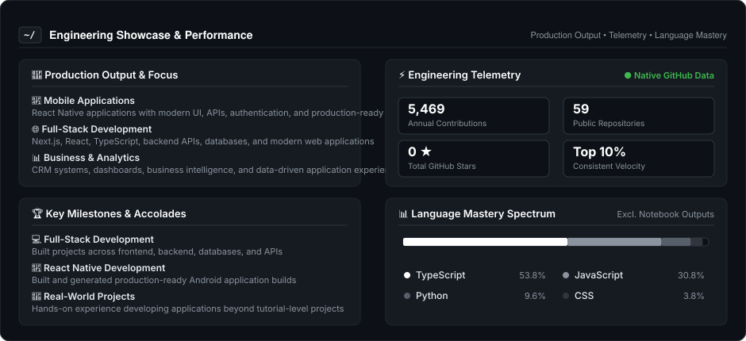

  
  
    

  # Kishan Singh
  
  

    
  

  ### Building Real-World Products with Code & AI
  
  **Full-Stack Developer • React Native Developer • Problem Solver**

   

  
  &nbsp;
  
  &nbsp;
  
  &nbsp;
  

---

### 👨‍💻 About Me

I'm a **Full-Stack Developer** focused on building practical, scalable, and user-friendly applications. I enjoy taking an idea from concept to a working product and continuously improving it through real-world development.

* 📱 **Mobile Development:** Building cross-platform applications with **React Native**, Expo, and modern mobile development practices.

* 🌐 **Web Development:** Working with **Next.js, React, TypeScript, Vite, Tailwind CSS**, and modern frontend architectures.

* ⚙️ **Backend & APIs:** Building application logic, REST APIs, authentication systems, databases, and integrations.

* 🤖 **AI & Data:** Exploring **Artificial Intelligence, data analytics, automation, and intelligent application development**.

* 💼 **Experience:** Hands-on development experience through internships, projects, and real-world application development.

* 🏗️ **Projects:** Building products including mobile applications, CRM systems, analytics platforms, and full-stack applications.

* 🧩 **Problem Solving:** Actively improving my **DSA, Java, algorithms, and software engineering fundamentals**.

* 🚀 **Goal:** Turn ideas into reliable products while continuously improving my engineering skills.

---

### 📡 Technical Capability & Skills Radar

  

---

### 🛠️ Core Tooling & Technologies

| **Category** | **Technologies** |
| :--- | :--- |
| **Mobile Development** |  |
| **Frontend & Web** |  |
| **Backend & Database** |  |
| **Programming & AI** |  |
| **Tools & Platforms** |  |

---

### 📈 Activity & Contribution Flow

  

---

### ⚡ Engineering Showcase & Performance

  

---

### 🎮 The Human Side

I'm not just a code machine. When the IDE closes, here is who I am:

* **💻 Current Focus:** Building full-stack and cross-platform applications while strengthening my software engineering fundamentals.
* **🧠 Problem Solver:** I regularly practice DSA and algorithms to improve my problem-solving and coding skills.
* **🚀 Builder:** I enjoy turning ideas into working products and learning by building real-world applications.
* **🤖 AI Explorer:** Exploring AI, automation, analytics, and intelligent systems that can solve practical problems.

---

  Let's build something meaningful together.

